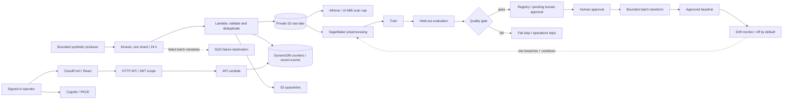

# StreamML

**My project for understanding transactions and testing a prediction model — Ali Adil.**

[Open the verified portfolio preview](https://aliadiill.github.io/streamml/) · [Successful Pages deployment](https://github.com/aliadiill/streamml/actions/runs/34569734895)

## What this project is about

I built StreamML around a fictional payments business. It has a dashboard for viewing transaction activity and a separate process for testing a model that estimates whether a transaction looks suspicious. A **model** is a program that learns patterns from examples. All the transaction data in this project is made up; I did not use real cards, customers or payments.

## The problem I wanted to solve

I wanted to answer two questions: **What is happening in the transactions?** and **Is a new model good enough to use?** A business needs useful answers even when a transaction arrives twice, a record is incomplete, or a new model makes too many mistakes. It also needs to keep the original records so someone can investigate later.

## My solution and how it works

I wrote two connected parts:

1. **The transaction part:** receive transactions, check their contents, avoid counting the same transaction twice, save the original records, and show recent activity on a dashboard. Simple rules mark items worth examining.
2. **The model part:** prepare example data, let a model learn from one group of examples, and test it on separate examples. Reject a model that fails the checks. In the full AWS design, a person must also approve a passing model before it can make predictions for a batch of records.

For example, if the same transaction arrives twice, the processing code is designed to count it once. If a model flags nearly every transaction, the quality checks reject it instead of treating a completed training run as a good result. I tested the processing rules locally and tested the model checks inside Docker on AWS. **Docker packages code with the software it needs to run.** The complete live transaction path was not deployed.

**[Start with my easy guide to every service and connection](docs/aws-services.md).** It follows the visitor, sign-in, API, data, model and build steps. It also explains public access and private data, what each service did, and which parts actually ran on AWS.

## What I actually ran

| Part | What I completed |
| --- | --- |
| Dashboard preview | Published a working GitHub Pages preview with clearly labelled sample data. It does not connect to AWS. |
| Docker and model experiment | Used AWS CodeBuild to build and run my Docker package, test learning and predictions, reject a deliberately poor model, and check the package for known security issues. |
| Final container scan | Passed with zero reported findings after two earlier builds failed their security scans. I kept the failed results and the fix in my documentation. |
| Complete AWS transaction and model system | Wrote the application and Terraform setup, but did **not** deploy the complete system. Kinesis access was restricted and the required SageMaker training and batch-prediction quotas were unavailable. |
| Main AWS CodePipeline | Defined in code, but not run. The separate CodeBuild experiment and GitHub Pages workflow did run. |

CodeBuild supplied the temporary AWS worker that built and tested the Docker package. A **quota** is an account limit on how much of a service can run. My [container experiment](docs/container-build.md) and [testing notes](docs/testing.md) record the results.

## What is available now

I removed the temporary AWS container-test environment after saving the results. I checked that its image store, file bucket, build project, access role and log group were gone and that no known build was still running. The source code, documentation, test evidence and GitHub Pages preview remain available.

I kept the runs short because I wanted to stay within a **one-time $100 credit budget**. I stayed on the Free plan and avoided keeping a prediction service running all day. My [cost notes](docs/cost.md) and [shared project cost report](docs/cost-report.md) explain the budget and billing records.


*I captured and verified this published GitHub Pages preview on 2026-09-11. I labelled the values as sample data and disabled AWS connections in this build. My AWS Docker experiment has separate execution evidence.*

[Earlier local dashboard](docs/screenshots/streamml-sample-dashboard.png) · [Model governance and transaction feed — actual local preview](docs/screenshots/streamml-governance-preview.png).

## Full system design — written, not deployed

The diagram below shows the complete design. It is not a picture of a currently running AWS system. My [service guide](docs/aws-services.md) explains the names in plain words; the sections after it keep the technical details needed to rebuild the project.



I explain my choices in the [architecture](docs/architecture.md), [ML design](docs/ml-design.md), [security](docs/security.md), and [service tradeoffs](docs/aws-services.md).

My [build journal](docs/build-journal.md) records blockers, failed image scans, corrective attempts and model limitations. My [Pages guide](docs/pages-preview.md) covers the static demonstration and its deployment history.

I used the isolated [CodeBuild container experiment](docs/container-build.md) to test preprocessing, training, evaluation, bad-model rejection and HTTP inference under a ten-minute build limit. This gave me AWS container evidence while the SageMaker execution remained blocked.

## Run locally

I made the project reproducible with Python 3.11+, Node 20.19+ or a supported newer release, npm and Terraform 1.10+. Docker is needed for a local container build. My local setup sequence is:

```bash
python -m venv .venv
# Activate .venv using your operating system's normal command.
python -m pip install -r requirements.txt
python -m unittest discover -s tests -v
python scripts/local_demo.py
python scripts/package.py
cd dashboard
npm ci
npm run build
npm run dev
```

I open the local address printed by Vite and select **Open sample preview** to inspect the labelled UI data. For authenticated development against a future deployment, I would copy `dashboard/.env.example` to `.env.local` and fill it from Terraform outputs. I keep tokens out of Git; public Cognito client identifiers are configuration.

I trained on the oldest 1,800 of 3,000 synthetic transactions, tuned the threshold on the next 600, and evaluated the newest 600. I measured **F1 0.9298, precision 0.9138, recall 0.9464 and false-positive rate 0.00919**, then reproduced those results inside Docker on AWS. These figures describe my synthetic experiment.

## Deploy deliberately

I chose `us-east-1` to keep the integrations in one region. I omitted a VPC and NAT Gateway because the design uses managed services. My full Terraform configuration defines Kinesis, private storage, IAM roles, functions, API/authentication, the dashboard edge, monitoring, analytics, a registry and optional ML/CI resources.

I documented my future [deployment sequence](docs/deployment.md) and the [cloud tests still to run](docs/testing.md). I check eligibility, quotas and credits before provisioning; Terraform validation alone did not establish that my account could run Kinesis or SageMaker.

I defined GitHub → CodePipeline → CodeBuild tests → manual deployment review → CodeBuild deployment in `infra/ci.tf`. I kept application delivery, infrastructure changes and model approval as separate controls. My [CI/CD notes](docs/ci-cd.md) distinguish that unrun AWS pipeline from the successful Pages workflow and container builds.

## Reliability and security that matter

- Canonical S3 object keys and content hashes detect conflicting duplicate event IDs.
- One DynamoDB transaction creates the deduplication marker, increments metrics, and writes the recent event.
- S3 is written first; a crash before the DynamoDB transaction is safe to retry. The marker survives seven days, which is the declared deduplication horizon.
- Invalid records are quarantined with a reason. Transient failures use Kinesis partial batch responses and bounded retries.
- Buckets are private, encrypted, versioned and deny insecure transport. CloudFront uses origin access control.
- The API requires a Cognito JWT with `streamml/read`; the SPA uses authorization code with PKCE and a public client without a secret.
- A candidate must meet six quality/support criteria. It enters the registry as `PendingManualApproval`. Batch inference rejects an unapproved package.
- Drift-triggered retraining is disabled by default, requires sufficient labelled data and two breaches, and permits at most one attempt per day.

I recorded my [operations approach](docs/monitoring.md), [teardown and cost work](docs/cost.md), and [troubleshooting lessons](docs/troubleshooting.md).

## Repository map

| Path | Purpose |
| --- | --- |
| `src/streamml/` | Ingestion, API, generator, model implementation, drift monitor |
| `ml/` | Container entrypoint, Dockerfile, actual pipeline-definition compiler |
| `scripts/` | Packaging, local experiment, bounded approved inference, deployment |
| `dashboard/` | React/TypeScript interface and PKCE authentication |
| `infra/` | Terraform resources, policies, provider lock, pipeline template |
| `tests/` | Failure, replay, validation, ML leakage/gate and API-shape tests |
| `docs/` | Architecture, decisions, runbooks, evidence and interview explanations |

I verified the published Pages preview, AWS CodeBuild Docker execution, ECR scan and temporary-infrastructure teardown. I have not run the full Kinesis ingestion path, authenticated AWS dashboard, SageMaker workflow or main CodePipeline. My [evidence guide](docs/screenshots/README.md) identifies each screenshot and execution record.
