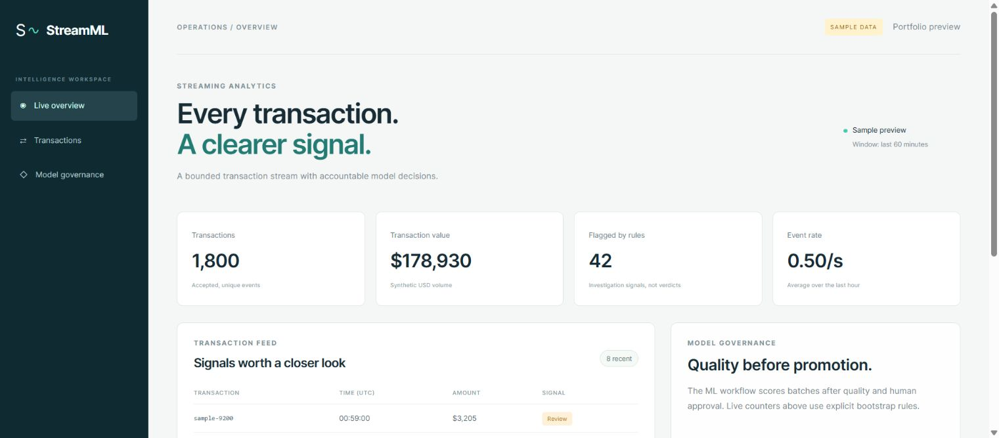
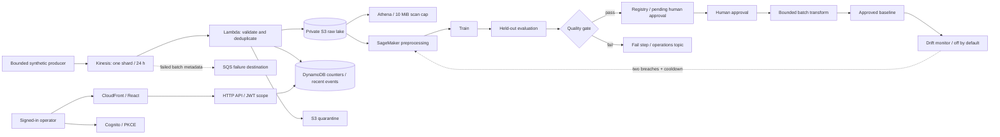

# StreamML

**My transaction analytics and MLOps portfolio project — Ali Adil.**

[Open the verified portfolio preview](https://aliadiill.github.io/streamml/) · [Successful Pages deployment](https://github.com/aliadiill/streamml/actions/runs/34569734895)

I built StreamML to connect transaction analytics with a controlled machine-learning workflow. I implemented a bounded synthetic producer, Kinesis integration, retry-safe Lambda processing, a private S3 data lake, DynamoDB metrics, an authenticated React dashboard and a SageMaker Pipelines definition. I wanted to answer two operational questions: *what is happening in the stream now?* and *is a new model good enough to use?*

**What I verified:** my [local tests](docs/testing.md), published Pages dashboard and isolated AWS CodeBuild deployment. The AWS run **passed Docker ML/HTTP tests and completed ECR scanning with zero reported findings**. I preserved two failed Debian-image scans, then fixed the base-image issue with Alpine while keeping the security gate unchanged. I have **not deployed the full streaming stack or run SageMaker or the main CodePipeline**: Kinesis eligibility and job quotas blocked that part of the lab. My [container evidence](docs/container-build.md) records the successful bounded AWS experiment.

**My cost approach:** I kept lab runs short and aimed for a **one-time $100 credit budget**. I used the Free plan, avoided always-on inference, and left the complete Kinesis-based stack undeployed when the service was unavailable. My [cost notes](docs/cost.md) explain the controls and billing delay, and my [shared project cost report](docs/cost-report.md) records the broader budget picture.

I removed the temporary container-test infrastructure after capturing the evidence. I verified that its image repository, artifact bucket, build project, role and log group were absent and that no known build remained running. I kept the source, metrics and failure history in this portfolio.



*I captured and verified this published GitHub Pages preview on 2026-09-11. I labelled the values as sample data and disabled AWS connections in this build. My AWS Docker experiment has separate execution evidence.*

[Earlier local dashboard](docs/screenshots/streamml-sample-dashboard.png) · [Model governance and transaction feed — actual local preview](docs/screenshots/streamml-governance-preview.png).

## Business problem

I used a payments-operations scenario to connect transaction visibility with reproducible training and controlled releases. I separated ingestion correctness, business rules, held-out model quality, human model approval and inference creation so that a successful training run alone cannot promote a model.

I generated fictional card identifiers and synthetic labels without real card numbers, names or payments. I use this dataset to demonstrate engineering behavior; I have not validated the model for financial fraud detection.

## Architecture



I explain my choices in the [architecture](docs/architecture.md), [ML design](docs/ml-design.md), [security](docs/security.md), and [service tradeoffs](docs/aws-services.md).

My [build journal](docs/build-journal.md) records blockers, failed image scans, corrective attempts and model limitations. My [Pages guide](docs/pages-preview.md) covers the static demonstration and its deployment history.

I used the isolated [CodeBuild container experiment](docs/container-build.md) to test preprocessing, training, evaluation, bad-model rejection and HTTP inference under a ten-minute build limit. This gave me AWS container evidence while the SageMaker execution remained blocked.

## Run locally

I made the project reproducible with Python 3.11+, Node 20.19+ or a supported newer release, npm and Terraform 1.10+. Docker is needed for a local container build. My local setup sequence is:

```bash
python -m venv .venv
# Activate .venv using your operating system's normal command.
python -m pip install -r requirements.txt
python -m unittest discover -s tests -v
python scripts/local_demo.py
python scripts/package.py
cd dashboard
npm ci
npm run build
npm run dev
```

I open the local address printed by Vite and select **Open sample preview** to inspect the labelled UI data. For authenticated development against a future deployment, I would copy `dashboard/.env.example` to `.env.local` and fill it from Terraform outputs. I keep tokens out of Git; public Cognito client identifiers are configuration.

I trained on the oldest 1,800 of 3,000 synthetic transactions, tuned the threshold on the next 600, and evaluated the newest 600. I measured **F1 0.9298, precision 0.9138, recall 0.9464 and false-positive rate 0.00919**, then reproduced those results inside Docker on AWS. These figures describe my synthetic experiment.

## Deploy deliberately

I chose `us-east-1` to keep the integrations in one region. I omitted a VPC and NAT Gateway because the design uses managed services. My full Terraform configuration defines Kinesis, private storage, IAM roles, functions, API/authentication, the dashboard edge, monitoring, analytics, a registry and optional ML/CI resources.

I documented my future [deployment sequence](docs/deployment.md) and the [cloud tests still to run](docs/testing.md). I check eligibility, quotas and credits before provisioning; Terraform validation alone did not establish that my account could run Kinesis or SageMaker.

I defined GitHub → CodePipeline → CodeBuild tests → manual deployment review → CodeBuild deployment in `infra/ci.tf`. I kept application delivery, infrastructure changes and model approval as separate controls. My [CI/CD notes](docs/ci-cd.md) distinguish that unrun AWS pipeline from the successful Pages workflow and container builds.

## Reliability and security that matter

- Canonical S3 object keys and content hashes detect conflicting duplicate event IDs.
- One DynamoDB transaction creates the deduplication marker, increments metrics, and writes the recent event.
- S3 is written first; a crash before the DynamoDB transaction is safe to retry. The marker survives seven days, which is the declared deduplication horizon.
- Invalid records are quarantined with a reason. Transient failures use Kinesis partial batch responses and bounded retries.
- Buckets are private, encrypted, versioned and deny insecure transport. CloudFront uses origin access control.
- The API requires a Cognito JWT with `streamml/read`; the SPA uses authorization code with PKCE and a public client without a secret.
- A candidate must meet six quality/support criteria. It enters the registry as `PendingManualApproval`. Batch inference rejects an unapproved package.
- Drift-triggered retraining is disabled by default, requires sufficient labelled data and two breaches, and permits at most one attempt per day.

I recorded my [operations approach](docs/monitoring.md), [teardown and cost work](docs/cost.md), and [troubleshooting lessons](docs/troubleshooting.md).

## Repository map

| Path | Purpose |
| --- | --- |
| `src/streamml/` | Ingestion, API, generator, model implementation, drift monitor |
| `ml/` | Container entrypoint, Dockerfile, actual pipeline-definition compiler |
| `scripts/` | Packaging, local experiment, bounded approved inference, deployment |
| `dashboard/` | React/TypeScript interface and PKCE authentication |
| `infra/` | Terraform resources, policies, provider lock, pipeline template |
| `tests/` | Failure, replay, validation, ML leakage/gate and API-shape tests |
| `docs/` | Architecture, decisions, runbooks, evidence and interview explanations |

I verified the published Pages preview, AWS CodeBuild Docker execution, ECR scan and temporary-infrastructure teardown. I have not run the full Kinesis ingestion path, authenticated AWS dashboard, SageMaker workflow or main CodePipeline. My [evidence guide](docs/screenshots/README.md) identifies each screenshot and execution record.
