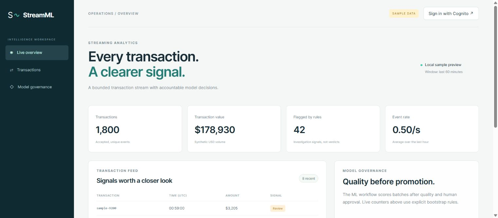
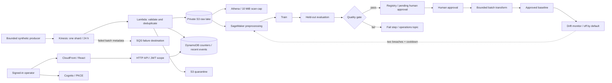

# StreamML

**Transaction intelligence with a real, gated machine-learning workflow.**

StreamML connects a bounded synthetic transaction generator to Kinesis, retry-safe Lambda processing, a private S3 data lake, DynamoDB metrics, an authenticated React dashboard, and SageMaker Pipelines. It answers two different operational questions: *what is happening in the stream now?* and *is a new model good enough to use?*

**Current status:** source implementation and local verification are complete as recorded in [testing](docs/testing.md). AWS deployment, authenticated cloud integration, actual SageMaker execution and CI/CD execution have **not** been verified. The learning account returned a Kinesis subscription/plan restriction during the lead's access checks; this project does not change the account plan. Screenshot evidence must distinguish the real local interface from a deployed AWS service.

**Cost constraint:** the owner permits at most **USD 100 total promotional-credit use**, with **zero personal/out-of-pocket spending now or later**. Keep the Free plan; no paid upgrade is authorized. The complete Kinesis-based stack therefore remains undeployed while that service is unavailable. Do not run the full Terraform apply under the current restriction.



*Actual local interface capture, 2026-09-11. Values are illustrative sample data, not a live AWS streaming result.*

[Model governance and transaction feed — actual local preview](docs/screenshots/streamml-governance-preview.png).

## Business problem

A payment-operations team needs a live view of transaction volume and risky activity, while the model team needs reproducible training and controlled releases. A model should not be promoted because a notebook ran successfully. StreamML separates ingestion correctness, operational business rules, held-out model quality, human approval, and inference resource creation.

The dataset uses fictional card identifiers and synthetic labels. It contains no card numbers, credentials, names, or real payments. This is an engineering lab, not a validated financial fraud model.

## Architecture



Read the [architecture](docs/architecture.md), [ML design](docs/ml-design.md), [security](docs/security.md), and [service tradeoffs](docs/aws-services.md).

## Run locally

Use Python 3.11+, Node 20.19+ or a supported newer Node release, npm, Terraform 1.10+, and Docker for the optional SageMaker container build.

```bash
python -m venv .venv
# Activate .venv using your operating system's normal command.
python -m pip install -r requirements.txt
python -m unittest discover -s tests -v
python scripts/local_demo.py
python scripts/package.py
cd dashboard
npm ci
npm run build
npm run dev
```

Open the local address printed by Vite. **Open sample preview** displays illustrative, clearly labelled UI data. It is not a cloud integration test. For real authenticated local development, copy `dashboard/.env.example` to `.env.local` and fill it using your Terraform outputs. Public Cognito client identifiers are configuration; tokens are never committed.

The deterministic local experiment creates 3,000 transactions, trains on the oldest 1,800, tunes the threshold on the next 600, and evaluates the newest 600. The recorded local holdout result is **F1 0.9298, precision 0.9138, recall 0.9464, false-positive rate 0.00919**. These are synthetic-data results, not production fraud-detection claims.

## Deploy deliberately

The primary region is `us-east-1` for service availability and one-region integration. There is no VPC or NAT Gateway in this managed-service lab. Terraform creates Kinesis, private storage, IAM roles, functions, API/authentication, the dashboard edge, monitoring, analytics, a registry, and optionally the ML pipeline and AWS CI/CD.

Follow [deployment](docs/deployment.md), then [cloud acceptance tests](docs/testing.md). Verify service eligibility and credits before applying. A Terraform validation result is not proof that this account can provision Kinesis or SageMaker.

GitHub → CodePipeline → CodeBuild tests → manual deployment review → CodeBuild deployment is implemented in `infra/ci.tf`. Application deployment and ML workflow changes have separate controls from Terraform infrastructure changes and model approval. Details: [CI/CD](docs/ci-cd.md).

## Reliability and security that matter

- Canonical S3 object keys and content hashes detect conflicting duplicate event IDs.
- One DynamoDB transaction creates the deduplication marker, increments metrics, and writes the recent event.
- S3 is written first; a crash before the DynamoDB transaction is safe to retry. The marker survives seven days, which is the declared deduplication horizon.
- Invalid records are quarantined with a reason. Transient failures use Kinesis partial batch responses and bounded retries.
- Buckets are private, encrypted, versioned and deny insecure transport. CloudFront uses origin access control.
- The API requires a Cognito JWT with `streamml/read`; the SPA uses authorization code with PKCE and a public client without a secret.
- A candidate must meet six quality/support criteria. It enters the registry as `PendingManualApproval`. Batch inference rejects an unapproved package.
- Drift-triggered retraining is disabled by default, requires sufficient labelled data and two breaches, and permits at most one attempt per day.

See [operations](docs/monitoring.md), [teardown and cost](docs/cost.md), and [known limits](docs/troubleshooting.md).

## Repository map

| Path | Purpose |
| --- | --- |
| `src/streamml/` | Ingestion, API, generator, model implementation, drift monitor |
| `ml/` | Container entrypoint, Dockerfile, actual pipeline-definition compiler |
| `scripts/` | Packaging, local experiment, bounded approved inference, deployment |
| `dashboard/` | React/TypeScript interface and PKCE authentication |
| `infra/` | Terraform resources, policies, provider lock, pipeline template |
| `tests/` | Failure, replay, validation, ML leakage/gate and API-shape tests |
| `docs/` | Architecture, decisions, runbooks, evidence and interview explanations |

No real AWS console screenshots or successful cloud executions are implied by this repository. [Evidence guide](docs/screenshots/README.md).
