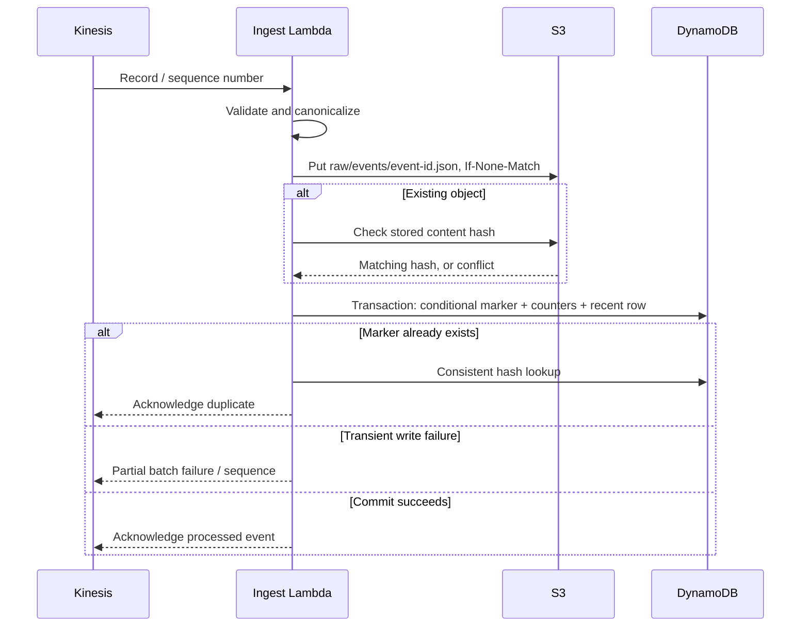

# Architecture and data integrity

## Two paths, two responsibilities

The streaming path provides operational counters quickly. It uses a transparent bootstrap business rule: a transaction above USD 1,000 is flagged when it also has substantial geographic distance or repeated attempts. The dashboard calls this **rules**, never an ML prediction.

The ML path trains an actual logistic-regression classifier from raw synthetic transactions. It runs preprocessing, training, evaluation and conditional registry registration as a real SageMaker Pipelines definition. Only a separately approved registry version may run bounded batch inference. That output contains the event ID, probability, and model decision. It is stored in S3; the current dashboard does not claim live model scoring or a live pipeline-status connection.

This separation makes the cost/latency tradeoff visible. An always-running inference endpoint would introduce a steady charge and another production dependency. For a certification portfolio, batch inference demonstrates the release gate without an idle endpoint.

## Event contract

Every event contains event ID, UTC timestamp, fictional card ID, integer amount in cents, distance, recent attempt count, merchant risk, online flag, and synthetic ground-truth label. Identifiers are bounded, unknown fields rejected, floats must be finite, integers cannot be booleans, and amounts/ranges are validated. Labels model a simulated delayed ground-truth source; a real system would join mature chargeback labels before retraining instead of trusting an incoming client label.

Producer caps: 10,000 records per invocation, 25 events/second maximum, four send attempts. Training preprocessing separately caps total input at 10,000 rows. The partition key is the fictional card identifier, spreading the learning stream across logical keys.

## Delivery and idempotency

This is not an atomic transaction across S3 and DynamoDB. S3 is the immutable canonical event payload; DynamoDB is the deduplication/counter commit. If the process stops after S3 succeeds, the retry verifies the hash and finishes the transaction. Different content under the same event ID is quarantined. A network failure after a successful transaction resolves through the conditional marker on retry.

Deduplication markers and aggregate counters have a seven-day TTL. DynamoDB expiration is asynchronous. Redelivering a valid event after its marker actually expires can count it again even when S3 still retains the object. Do not promise lifetime exactly-once processing. Retain markers longer or use a durable ledger before extending the supported replay window.

Recent events have a one-day TTL. A global secondary index exposes the latest 30 events to the authenticated API. The index and read metrics are eventually consistent. The API batches only 60 minute buckets and retries unprocessed keys at most three times.

## Failure containment

Malformed input is acknowledged only after quarantine succeeds. A failed quarantine write remains retryable. Persistent processing failures eventually reach the SQS destination as failed-batch metadata. This metadata is not guaranteed to include every original Kinesis payload. The operator must investigate promptly while the stream still retains data or use the existing raw lake for events whose write already succeeded.

Kinesis retention is 24 hours; the event source stops retrying after one hour or its retry limit. A pause longer than retention causes unrecoverable stream loss for records that never reached S3. Document the gap instead of replaying an invented dataset.

## Scale and recovery

One shard, small batches, pay-per-request DynamoDB, and a 10 MiB Athena query ceiling are intentional learning limits. Lambda concurrency is not reserved because the learning account has a small shared quota. At higher throughput, the single DynamoDB minute-counter key becomes hot. Shard counters by producer/key and aggregate on read; use partitioned columnar lake files and a compaction job before scaling Athena.

S3 versioning and DynamoDB point-in-time recovery support storage recovery. Restoring a table requires updating the application configuration and re-evaluating counter consistency. Backup and restore behavior is designed but remains an unrun AWS acceptance test.
