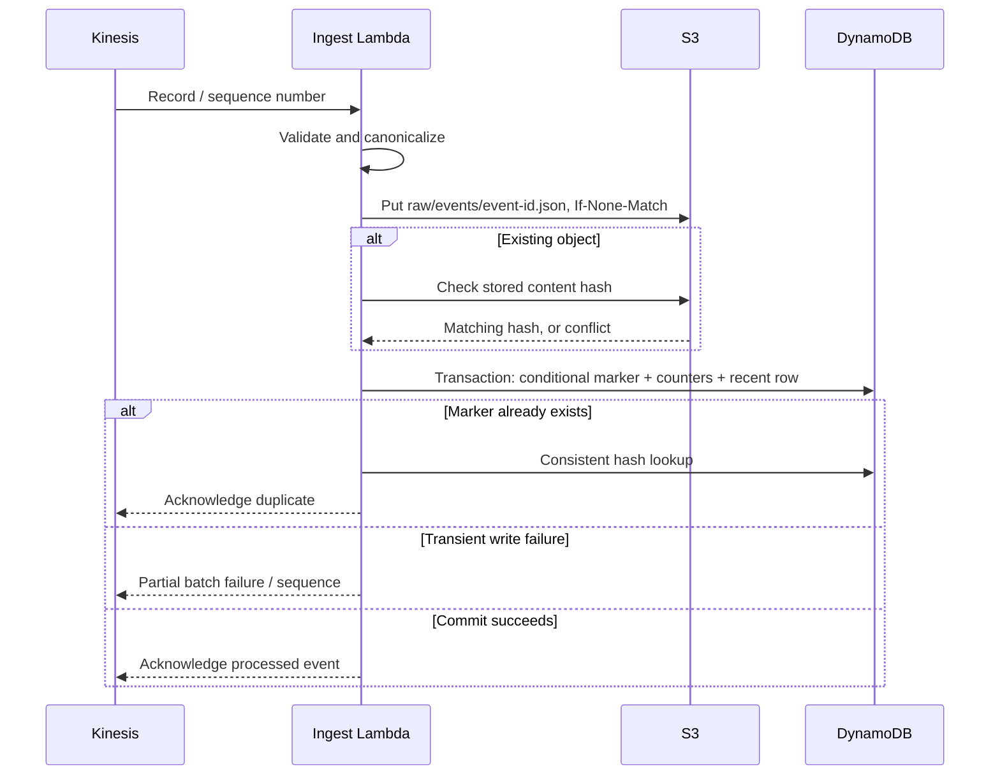

# Architecture and data integrity

## Two paths, two responsibilities

I designed the streaming path to provide operational counters quickly. It uses a transparent bootstrap business rule: a transaction above USD 1,000 is flagged when it also has substantial geographic distance or repeated attempts. The dashboard calls this **rules**, never an ML prediction.

I implemented a logistic-regression classifier and a SageMaker Pipelines definition for preprocessing, training, evaluation and conditional model registration. I tested the container entrypoints on AWS CodeBuild; the SageMaker execution remains unrun. Only a separately approved registry version may run bounded batch inference. That output contains the event ID, probability, and model decision. It is stored in S3; the current dashboard does not claim live model scoring or a live pipeline-status connection.

I chose this separation to make the cost/latency tradeoff visible. An always-running inference endpoint would introduce a steady charge and another production dependency. I designed batch inference to exercise model release controls without an idle endpoint.

## Event contract

I defined each event with an event ID, UTC timestamp, fictional card ID, integer amount in cents, distance, recent attempt count, merchant risk, online flag, and synthetic ground-truth label. Identifiers are bounded, unknown fields rejected, floats must be finite, integers cannot be booleans, and amounts/ranges are validated. Labels model a simulated delayed ground-truth source; a real system would join mature chargeback labels before retraining instead of trusting an incoming client label.

I capped the producer at 10,000 records per invocation, 25 events/second and four send attempts. Training preprocessing separately caps total input at 10,000 rows. The partition key is the fictional card identifier, spreading the learning stream across logical keys.

## Delivery and idempotency

I treat S3 and DynamoDB as two separate commits rather than one atomic transaction. S3 is the immutable canonical event payload; DynamoDB is the deduplication/counter commit. If the process stops after S3 succeeds, the retry verifies the hash and finishes the transaction. Different content under the same event ID is quarantined. A network failure after a successful transaction resolves through the conditional marker on retry.

I gave deduplication markers and aggregate counters a seven-day TTL. DynamoDB expiration is asynchronous. Redelivering a valid event after its marker actually expires can count it again even when S3 still retains the object. I therefore limit the guarantee to that retention horizon. I would keep markers longer or add a durable ledger before extending the replay window.

I gave recent events a one-day TTL. A global secondary index exposes the latest 30 events to the authenticated API. The index and read metrics are eventually consistent. The API batches only 60 minute buckets and retries unprocessed keys at most three times.

## Failure containment

I acknowledge malformed input only after quarantine succeeds. A failed quarantine write remains retryable. Persistent processing failures eventually reach the SQS destination as failed-batch metadata. This metadata is not guaranteed to include every original Kinesis payload. My recovery plan is to investigate while the stream still retains the data, or use raw-lake records whose writes already succeeded.

I configured Kinesis retention for 24 hours; the event source stops retrying after one hour or its retry limit. A pause longer than retention causes unrecoverable stream loss for records that never reached S3. I would record that data gap explicitly rather than manufacture a replacement dataset.

## Scale and recovery

I chose one shard, small batches, pay-per-request DynamoDB and a 10 MiB Athena query ceiling for this lab. Lambda concurrency is not reserved because the learning account has a small shared quota. At higher throughput, the single DynamoDB minute-counter key becomes hot. At that scale, I would shard counters by producer/key, aggregate on read and introduce partitioned columnar files with compaction before expanding Athena use.

I included S3 versioning and DynamoDB point-in-time recovery in the recovery design. Restoring a table requires updating the application configuration and re-evaluating counter consistency. I have not yet run the full-stack backup and restore tests.
