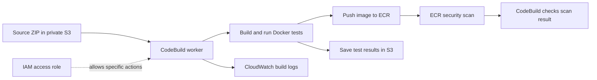
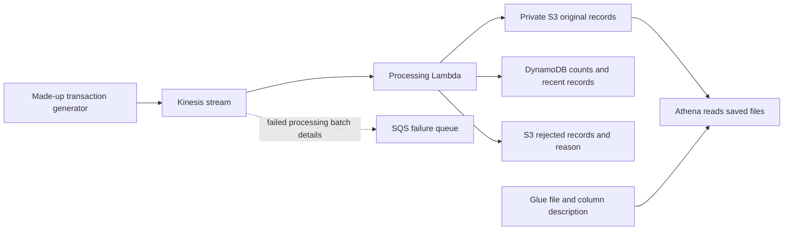
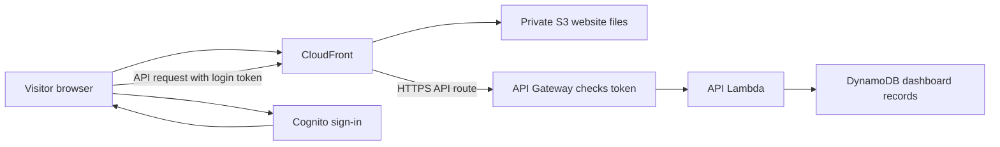
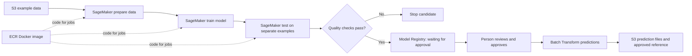
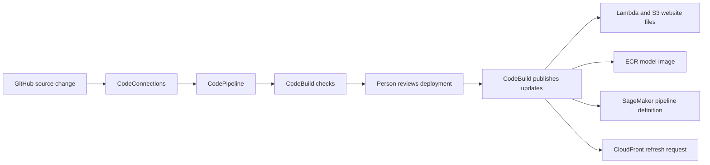

# StreamML: what each service did, in easy words

[Back to the project](../README.md) · [Open the sample dashboard](https://aliadiill.github.io/streamml/)

## What I built and why

I built StreamML around a fictional payments business. I wanted to show transaction activity clearly and test whether a prediction model was good enough to consider using. A **transaction** is a record of a payment. A **model** is a program that learns patterns from examples and uses them to estimate an answer.

The problem is bigger than drawing a chart. The same transaction can arrive twice, some records can be incomplete, and a model can make too many mistakes. My solution separates receiving and checking records, storing them, showing activity, and testing a model before allowing it to be used.

I used made-up transactions throughout. This is a learning project, not a live payment system or proof that the model would detect fraud in a real bank.

## First, what actually ran?

I ran a **small Docker and model experiment on AWS**. I did **not** deploy the complete transaction system shown later in this guide.

| Part | Status |
| --- | --- |
| Docker build, model tests, prediction tests and container security scan | Ran in AWS CodeBuild. The final build passed. |
| Temporary S3 bucket, ECR image store, IAM role and CloudWatch logs | Created for that experiment, used, then removed after saving evidence. |
| Complete Kinesis, Lambda, database, login, dashboard API and SageMaker system | Written in code but not deployed as a complete AWS application. |
| Main CodePipeline release process | Written in code but not run. |
| Public GitHub Pages dashboard | Published with sample data. It makes no AWS requests. |

Kinesis was unavailable under the account's service eligibility, and the required SageMaker training and batch-prediction job quotas were unavailable. I documented those limits and tested the Docker workload separately. A **quota** is an account limit on how much of a service can run.

## AWS services I actually used in the container experiment

| Service | What it did in my experiment | Why I needed it |
| --- | --- | --- |
| **AWS CodeBuild** | Started a temporary worker, built my Docker image, ran data preparation and model tests, tested predictions, and checked the scan result. I limited each build to ten minutes. | I could test the actual container on AWS without deploying the complete application. |
| **Amazon ECR — Elastic Container Registry** | Stored my Docker images and reported scan results for known security issues. Each tested image had an exact identifier. | A container needs somewhere to be stored, and unsafe scan results needed to stop the build. |
| **Amazon S3 — Simple Storage Service** | Stored the source ZIP used by CodeBuild and the files produced by the tests. The bucket was private, encrypted and kept file versions. | The worker needed somewhere to read its input and save its results. |
| **AWS IAM — Identity and Access Management** | Gave CodeBuild an access role limited to its source files, result files, images and logs. | The worker needed permission to do its job without control over the whole AWS account. |
| **Amazon CloudWatch Logs** | Collected build output, errors and test messages. | I used those records to understand failures and verify the final result. |

An **image** here means the saved Docker package, not a photograph. A **container** is a running copy of that package. Docker packages the program; ECR stores the package; CodeBuild ran the build and test work.

### How the tested AWS parts connected

1. I packaged selected source files into a ZIP and uploaded it to the private S3 bucket.
2. I started CodeBuild manually. Its IAM role allowed it to read that ZIP, use the project's ECR repository, save results and write logs.
3. CodeBuild built the Docker image and pushed it to ECR. Inside the build it ran containers for data preparation, training, evaluation and deliberately poor-model rejection.
4. It briefly started a prediction server and sent three test requests from within the build environment. This was not a public prediction service.
5. CodeBuild waited for ECR's security scan and checked the findings. Test results went back to S3; progress and errors went to CloudWatch Logs.
6. I saved the evidence, checked that the builds had finished, emptied the owned temporary files and images, and removed the environment.

The first image failed scanning with critical and high findings. Updating its Debian packages did not clear them, so the second attempt also failed. I changed to a compatible Alpine base image. The third build passed the same model and prediction tests, and its completed scan reported zero findings. I did not lower the security standard to get a pass.

A **base image** supplies the starting operating-system files and runtime for a container. A clean scan describes the tested image at that time; it is not a promise that no issue will ever be found. My [container experiment](container-build.md), [execution evidence](evidence/container-execution.json) and [build journal](build-journal.md) record both failures, the correction, results and cleanup.

## Where things sit: public access and private data

I did **not** create a project VPC or public/private subnets for StreamML. A **VPC** is a network I could manage in AWS, and a **subnet** is a section of that network. The experiment and the full design use managed services instead of placing application servers in my own subnets.

| Part | Where it sits and who can reach it |
| --- | --- |
| GitHub Pages preview | Public website on GitHub. Its sample data stays in the preview; it does not call AWS. |
| CloudFront in the full design | A public AWS website entry point outside a project VPC. It would serve the website and route API requests. |
| Cognito in the full design | A reachable AWS sign-in page. Signing in does not give someone direct database access. |
| API Gateway in the full design | An internet-reachable API that requires a valid sign-in token and read permission. It is not a private-subnet API. |
| S3, DynamoDB, ECR and Kinesis | AWS-managed services with access controlled by permissions. A private S3 bucket means public reading is blocked; it does not mean the bucket is inside a private subnet. |
| Lambda in the full design | AWS-managed function runtime. These functions are not attached to project VPC subnets. Their roles control which AWS data they can read or change. |
| CodeBuild and future SageMaker jobs | Temporary managed workers/jobs. This repository does not attach them to project VPC subnets. |

I used HTTPS for service connections and access rules for data. I did not add an Internet Gateway, NAT Gateway, load balancer or application EC2 servers to StreamML.

## Complete transaction flow — written, not deployed

These sections explain the full application design in the repository. They are not additional successful AWS deployments.

| Service | Its exact job in the design | Problem it helps solve |
| --- | --- | --- |
| **Amazon Kinesis Data Streams** | Receives the continuing transaction flow and holds records for processing. I defined one stream unit and a 24-hour record window, grouping related card events together. | The producer and processing function do not have to work at exactly the same moment. |
| **AWS Lambda: processing function** | Checks fields, detects repeated IDs, saves good records, updates counts, and sets aside bad records with a reason. | Incomplete records and repeated deliveries should not silently damage the counts. |
| **Amazon S3: transaction storage** | Keeps original records, rejected records, prepared datasets, model files, evaluation reports and prediction results privately. | Original information remains available for investigation and model work. |
| **Amazon DynamoDB** | Holds recent transactions, totals and records of IDs already processed. Related database changes happen together or fail together. | A repeat should not increase a counter twice, and the dashboard needs quick reads. |
| **Amazon SQS — Simple Queue Service** | Holds information about stream batches that still could not be processed after retries. It is not a full copy of every original transaction. | Failed work leaves something to investigate. |
| **AWS Glue Data Catalog** | Describes where transaction files are and which fields they contain. I wrote that description directly, without a Glue crawler. | The query tool needs to know how to read saved files. |
| **Amazon Athena** | Uses SQL, a language for asking questions about data, to read S3 files. A supplied query groups counts and amounts by hour. | I can design analysis without operating another database server. |

### Following one transaction

1. The Python generator creates a made-up transaction and sends it to Kinesis.
2. The Lambda/Kinesis connection supplies records to the processing function in small batches.
3. Lambda checks each record. A bad record is saved separately in S3 with its reason. If saving fails, the function does not pretend that work succeeded.
4. For a good record, Lambda writes the original to a predictable S3 location. The same ID with conflicting contents is treated as a problem.
5. Lambda updates DynamoDB: remember the processed ID, update the count, and save the recent transaction together. A repeated delivery with the same contents does not count twice. That protection lasts seven days in this small design.
6. If the function stops after the S3 write, retrying can finish the database work. The connection retries failed work within its limits; exhausted failures send batch details to SQS.
7. Later, Athena can read the saved S3 records using the Glue description. Query results go back to S3. I set a small limit on data read per query.

The processing rules have local tests. This complete Kinesis-to-storage flow was not run on AWS.

## Website, sign-in and API flow — written, not deployed

An **API** is a way for one program to ask another program for information. The dashboard would ask this API for recent transaction figures.

| Service | Its exact job in the design |
| --- | --- |
| **Amazon S3: website bucket** | Stores the dashboard's website files privately, separately from transaction data. |
| **Amazon CloudFront** | Delivers the website over HTTPS and routes `/api/*` requests to API Gateway over HTTPS. Website files may be cached; API answers are not cached. |
| **Amazon Cognito** | Manages sign-in and gives the browser a short-lived login token. The design supports an optional authenticator-app check. |
| **Amazon API Gateway** | Checks the token and `streamml/read` permission before sending a metrics request to Lambda. |
| **AWS Lambda: API function** | Reads the needed DynamoDB records and returns them in the dashboard's expected format. |

1. The browser opens the CloudFront address. CloudFront gets the website files from private S3 using its allowed identity. The visitor is not granted direct S3 access.
2. The visitor chooses sign-in and goes to Cognito. After sign-in, Cognito sends the browser back with a short-lived code.
3. The browser exchanges that code for tokens using PKCE, a login protection that ties the exchange to the browser that started it. No application password is embedded in the website.
4. The dashboard requests `/api/metrics` on the CloudFront address and includes its access token. CloudFront passes the request to API Gateway.
5. API Gateway checks who issued the token, which application it belongs to and its read permission. A missing or invalid token does not reach the protected function as an allowed request.
6. The API Lambda uses its IAM role to read DynamoDB. The browser never receives database credentials.
7. The result returns through API Gateway and CloudFront to the browser, which draws the figures on screen.

The API's own AWS address is also internet-reachable and protected by its token checks; I did not claim CloudFront is its only possible network entry. The current GitHub Pages preview uses sample data instead of this AWS sign-in and data path.

## Model flow — written, not run in SageMaker

**Training** means learning from examples. **Prediction** means using the learned model on another example. I tested both inside Docker on CodeBuild, but not through the full SageMaker workflow below.

| Service or feature | Its exact job in the design | Why I included it |
| --- | --- | --- |
| **Amazon SageMaker Pipelines** | Coordinates the model-building steps and stops when a check fails. | Finishing training alone should not approve a model. |
| **SageMaker Processing jobs** | Prepare the data and evaluate the trained model on separate test examples. | The input needs to be consistent and the final test needs unseen examples. |
| **SageMaker Training jobs** | Run the Docker training code and save a model file. | Training has defined inputs, code and outputs. |
| **SageMaker Model Registry** | Records passing model versions as waiting for human approval. | Someone can review results before approving a candidate. |
| **SageMaker Batch Transform** | Makes predictions for a limited batch using an approved model. | A prediction server does not have to run all day. |
| **Amazon ECR: model images** | Supplies the Docker package for model jobs. | Jobs can use the same packaged code and runtime. Only the separate CodeBuild experiment used ECR in practice. |
| **Amazon S3: model files** | Holds input datasets, prepared data, model files, evaluation reports, prediction outputs and the approved reference used for later comparisons. | Each stage can read the prior stage's saved output. |

SageMaker Pipelines would pass file locations between jobs. Each job would read the required S3 files, run its ECR image using its allowed IAM role, and save its results to S3. A failed quality check stops registration; a passing check creates a candidate awaiting review. The batch script checks that the model is approved before creating prediction work. Model approval is separate from approving an application-code deployment.

My model uses **logistic regression**, a method that combines values to estimate a chance. Inputs include amount, distance, recent attempts, merchant risk and online status. I split 3,000 examples by time: 1,800 for learning, 600 to choose how high a score should be before an example is flagged, and 600 for the final test.

On the final 600 made-up examples, the model correctly flagged 53 suspicious examples, incorrectly flagged five normal examples, missed three suspicious examples and correctly left 539 normal examples unflagged. I reproduced those results inside Docker on AWS. They describe this experiment, not real-bank performance.

The dashboard's immediate warning flags use simple rules. The separate model workflow handles batches; I do not claim every dashboard event was scored by the model. My [model guide](ml-design.md) keeps the detailed checks and limits.

## Monitoring, notifications and model changes — full design only

| Service | Its exact job |
| --- | --- |
| **AWS Lambda: monitoring function** | Reads newer DynamoDB records and the approved S3 reference, compares them, saves a report in S3 and tracks checks in DynamoDB. A change in the data is called data drift. |
| **Amazon EventBridge** | Schedules the check and routes failed SageMaker pipeline events to the operations notification topic. |
| **Amazon CloudWatch** | Stores function/API logs and measures errors, processing delay and failed work. Alarms send configured warnings to SNS. |
| **Amazon SNS — Simple Notification Service** | Provides a topic that could deliver operations warnings to configured subscribers. No delivered warning was demonstrated. |
| **AWS IAM** | Gives each function and job its own allowed actions for the specific data and services it needs. |

The planned connection is **EventBridge schedule → monitoring Lambda → read S3 and DynamoDB → save report and check state → optionally start SageMaker Pipelines**. The schedule and automatic retraining start disabled. Starting training automatically would require enough examples with known answers, repeated evidence of a change, and a waiting period between attempts. It cannot approve its own replacement model.

A changed data pattern does not prove that the model is wrong. The checks prompt investigation; quality tests and human approval still matter. Separately, a failed SageMaker run would send an event through EventBridge to SNS, while application measurements would trigger CloudWatch alarms connected to SNS. See my [monitoring guide](monitoring.md).

## Delivering changes — main pipeline written, not run

| Service | Its exact job in the main delivery design |
| --- | --- |
| **AWS CodeConnections** | Lets the pipeline read the selected GitHub source through the shared authorized connection. That connection was available, but this main pipeline did not run through it. |
| **AWS CodePipeline** | Coordinates getting the source, checking it, waiting for a deployment review and publishing the change. |
| **AWS CodeBuild: main release workers** | Run the checks and prepare and publish application updates. These workers are separate from the container-test project that actually ran. |
| **Amazon S3: release files** | Holds files passed between pipeline stages. This is separate from the bucket used in the real container experiment. |

CodeBuild's checks cover Python, the model experiment, the dashboard, dependency checks and Terraform validation. After review, its deployment job would package the functions and website, build and scan the image, update the functions and S3 files, ask CloudFront to refresh the website entry, and update the SageMaker pipeline definition. These service changes are not one all-or-nothing operation; a partial failure needs investigation and recovery.

I kept infrastructure creation in a separate Terraform review/apply process. The main pipeline does not automatically train a model after every commit by default, and its deployment review is separate from approval of a model. My [release notes](ci-cd.md) explain those limits.

## Other tools and billing checks

These tools support the work rather than being extra application services.

| Tool or account view | What I used it for |
| --- | --- |
| **Terraform** | Wrote the AWS setup as reviewable files. This is infrastructure as code. I applied and removed the small container setup; I validated but did not apply the full application setup. |
| **Docker** | Packaged the Python runtime and model code and ran the real tests inside containers on AWS. |
| **Python** | Wrote the made-up data generator, processing code, model, API logic and tests. |
| **React and TypeScript** | Built the dashboard screens and browser behavior. React helps build the interface; TypeScript helps check the code. |
| **Node.js, npm and Vite** | Installed dashboard dependencies, built the website and ran the local preview. |
| **Git and GitHub** | Kept meaningful commits and published source, instructions, screenshots and results. |
| **GitHub Actions** | Built and published the sample website in a recorded workflow, separately from AWS CodePipeline. |
| **GitHub Pages** | Hosts the public sample dashboard after the AWS experiment was removed. |
| **AWS CLI and SDK** | Sent setup, test, status and cleanup requests to AWS from commands and Python scripts. |
| **AWS Billing and Cost Explorer** | Read account cost information for the shared portfolio cost report. These are account checks, not components that process StreamML transactions. |
| **AWS Free Tier and credit information** | Checked the account plan and available promotional-credit information. Recent usage can appear late, so an empty recent billing result was not treated as proof that nothing was used. |

The lasting website's route is **GitHub source → GitHub Actions build → GitHub Pages → visitor's browser with sample data**. No AWS login, payment records or AWS backend is involved in that preview.

## What remains available

I removed the temporary container experiment and verified its cleanup. The full AWS application was never deployed. I kept the source, repeatable setup, local tests, actual Docker and scan evidence, failure history, documentation and sample-data website. My [cost notes](cost.md), [shared cost report](cost-report.md), [testing guide](testing.md) and [future deployment steps](deployment.md) explain the boundaries and remaining work for a complete AWS demonstration.
